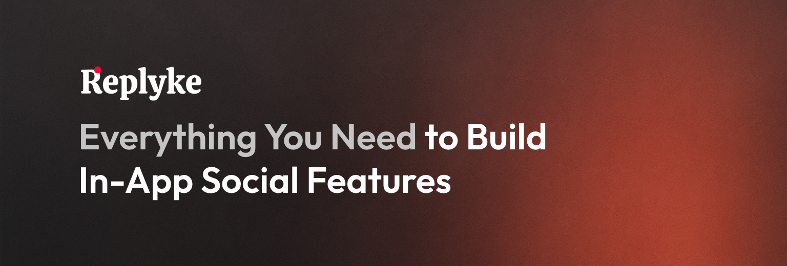

# Replyke: Open-Source Framework for Building Social Products

<!--  -->

    
     
     
    <h3 align="center">Replyke is an open source toolkit for adding production‑grade social features to any web or mobile app.</h3>
     
     

 

Replyke gives developers a complete foundation for building social experiences - comments, votes, notifications, feeds, and more - without reinventing the wheel. Instead of wiring together a mix of libraries or building from scratch, Replyke offers drop-in APIs, SDKs, and components that are production-ready out of the box.

Built with a headless, TypeScript-first architecture, Replyke fits seamlessly into your stack. Whether you’re building a full social network or just need user comments on a blog post - Replyke has you covered.

## Table of Contents

<!-- - [Project Snapshots](#project-snapshots) -->

- [Key Features](#key-features)
- [Why Replyke](#why-replyke)
- [Comparison With Alternatives](#comparison-with-alternatives)
- [Documentation](#documentation)
- [Contributing](#contributing)
- [Community and Support](#community-and-support)
- [License](#license)

## Key Features

- **Comment system** - threaded replies, markdown, mentions, votes, moderation hooks
- **Feeds** - filter by tags, following or geography with hot, top or new sorting
- **In‑app notifications** - configurable events for votes, mentions, follows and more
- **Curated lists** - user folders and nested collections of entities
- **Follow graph** - one‑way follow relationships ready for social graphs
- **Admin tools** - reporting, suspensions, reputation and audit logs built in

All features come with backend APIs, typed SDKs and ready to use React and React Native components.

## Why Replyke

- **Save months of work** - plug in battle‑tested social primitives instead of reinventing them
- **Headless first** - bring your own auth and UI or use the included components
- **Full TypeScript stack** - the same types flow from database to client hooks
- **Self host (DIY) or cloud** - open‑source core plus an optional managed service for zero ops

<!-- ---

## Project Snapshots

> Replace the following placeholders with real screenshots or gifs.

| Dashboard                                           | Comment Section                                                 |
| --------------------------------------------------- | --------------------------------------------------------------- |
|  |  | -->

## Comparison With Alternatives

|                        | **Replyke** | Disqus        | Supabase + DIY | Custom Build |
| ---------------------- | ----------- | ------------- | -------------- | ------------ |
| Open source            | ✔           | ✖             | ✔              | —            |
| Full social toolkit    | ✔           | Comments only | ✖              | —            |
| Self host              | ✔ (DIY)     | Limited       | ✔              | ✔            |
| React hooks & ready UI | ✔           | ✖             | ✖              | —            |

## Documentation

Full API reference, guides and recipes live at **[https://docs.replyke.com](https://docs.replyke.com)**.

## Contributing

Bug reports are welcome. contributing guide coming soon - [Join Discord server for updates.](https://discord.gg/REKxnCJzPz)

<!-- ---
1. Read the [contributing guide](CONTRIBUTING.md)
2. Pick an issue or open a discussion
3. Run `pnpm test` before pushing

Good first issues are tagged with **good first issue**. -->

## Community and Support

- **Discord** - [https://discord.gg/REKxnCJzPz](https://discord.gg/REKxnCJzPz)
- **Blog** - [https://blog.replyke.com](https://blog.replyke.com)

- **X/Twitter**
  - Replyke - [https://x.com/yantsab](https://x.com/yantsab)
  - Yanay (Developer) - [https://x.com/yantsab](https://x.com/yantsab)
- **LinkedIn**

  - Replyke - [https://www.linkedin.com/company/replyke](https://www.linkedin.com/company/replyke)
  - Yanay (Developer) - [https://www.linkedin.com/in/yanay-zabary/](https://www.linkedin.com/in/yanay-zabary/)

- **Email** - [support@replyke.com](mailto:support@replyke.com)

## License

Replyke is released under the **AGPL‑3.0‑only** license. See [LICENSE](LICENSE) for details.
